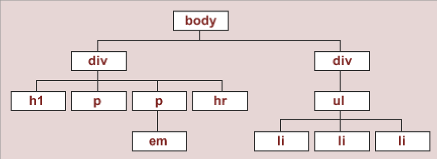

# Question 2
What does it mean when a tag is a "child" of a "parent?".

# Answer
When a tag is a "child" of a "parent", it means that it is nested inside another tag, called the parent. If the tags are at the same nesting level next to each other, they are considered sibling tags to each other as they share the same parent.

Here's an interesting fact: the reason why tag levels in HTML are discerned by familial terms such as `parent` and `child` is because every HTML document is considered a `document tree`. The elements in this tree are described just as we would describe a family tree. In HTML, alongside parents, children, and siblings, there are also ancestors and descendants.



Above is an example of what the HTML document tree looks like. Here is what a child and parent tag looks like:

```html
<div class="root-element">
    <div class="parent">
        <div class="child-A">
            child content; sibling to child-B
        </div>
        <div class="child-B">
            child content; sibling to child-A
        </div>
    </div>
</div>
```

# Teacher Feedback
3/3. Nicely done! You understood the assignment as always :) Really happy you give verbose answers with code snippets. 